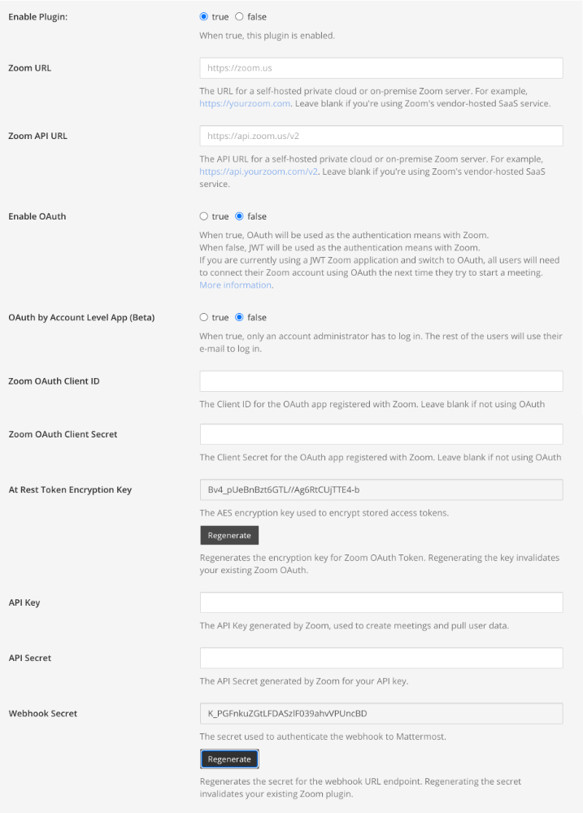

# Mattermost Setup

## Zoom plugin setup guide

**Note:** You need a paid Zoom account to use the plugin.

### First steps

* Enable settings for [overriding usernames](https://docs.mattermost.com/administration/config-settings.html#enable-integrations-to-override-usernames) and [overriding profile picture icons](https://docs.mattermost.com/administration/config-settings.html#enable-integrations-to-override-profile-picture-icons).
* Go to **System Console > Plugins > Zoom** to configure the Zoom Plugin.

### Plugin configuration

* Set **Enable Plugin** to `true`.
* How are you hosting Zoom?
  * **Self Hosted?**
    * If you're using a self-hosted private cloud or on-premises Zoom server, enter the **Zoom URL** and **Zoom API URL** for the Zoom server, for example `https://yourzoom.com` and `https://api.yourzoom.com/v2` respectively. Leave blank if you're using Zoom's vendor-hosted SaaS service.
  * **Cloud Hosted?**
    * Leave **Zoom API URL** and **Zoom URL** fields blank.
* How are your users connecting to Zoom? \([more information](zoom-configuration/)\)
  * **OAuth?**
    * Set **Enable OAuth** to `true`.
    * Use the Client ID and Client Secret generated during [Zoom Configuration](zoom-configuration/zoom-setup-oauth.md) to fill in the fields **Zoom OAuth Client ID** and **Zoom OAuth Client Secret**.
    * Select **Regenerate** next to the field **At Rest Token Encryption Key**.
    * Make sure **Enable Password based authentication** is set to `false`.
    * Ignore **API Key** and **API Secret** fields.
* If you are using Webhooks or Deauthorization, make sure you hit the **Regenerate** button on **Webhook Secret** field.
* Select **Save**.
