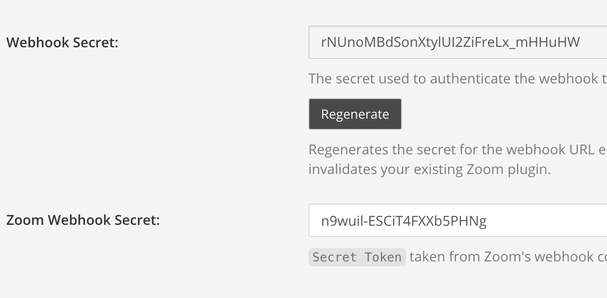
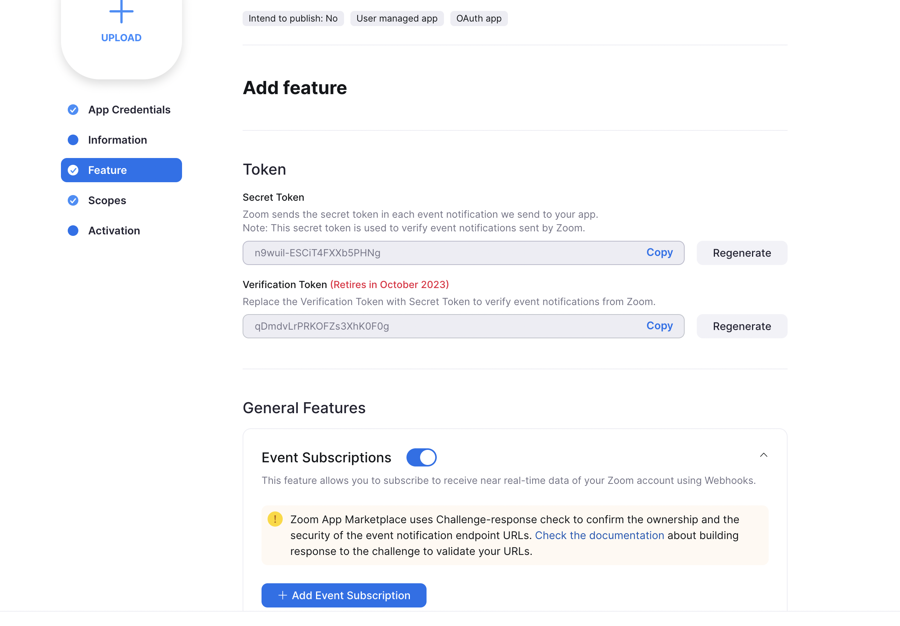
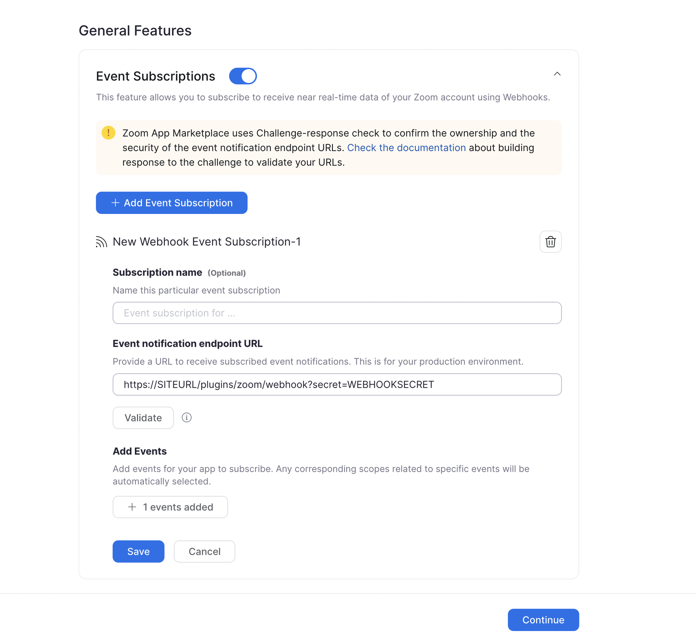

# Webhook Configuration

## Configure webhook events

When a Zoom meeting ends, the original link shared in the channel can be changed to indicate the meeting has ended and how long it lasted. To enable this functionality, you can create a webhook subscription in Zoom that tells the Mattermost server every time a meeting ends. The Mattermost server then updates the original Zoom message.

Select **Feature** in the left sidebar to begin setting up the webhook subscription.

### Configuring webhook authentication

1. Copy the "Secret Token" value from Zoom's form.
2. Paste this value into the Zoom plugin's settings in the Mattermost system console for the `Zoom Webhook Secret` field.

3. In the Mattermost system console, generate and copy the `Webhook Secret`. We'll use this value in the next section.

Zoom's webhook secret authentication system has been made required for all webhooks created or modified after the new system was rolled out. In order to maintain backwards compatibility with existing installations of the Zoom plugin, we still support (and also require) the original webhook secret system used by the plugin. So any new webhooks created will need to be configured with both secrets as mentioned in the steps above.

### Configuring webhook events

1. Enable **Event Subscriptions**.
2. Select **Add New Event Subscription** and give it a name \(e.g. "Meeting Ended"\).
3. Construct the following URL, where `SITEURL` is your Mattermost server URL, and `WEBHOOKSECRET` is the value in the system console labeled `Webhook Secret`.
4. Enter in the **Event notification endpoint URL** field the constructed URL:

`https://SITEURL/plugins/zoom/webhook?secret=WEBHOOKSECRET`

5. Select **Add events** and select the **End Meeting** event.
6. Select **Done** and to save your app.

