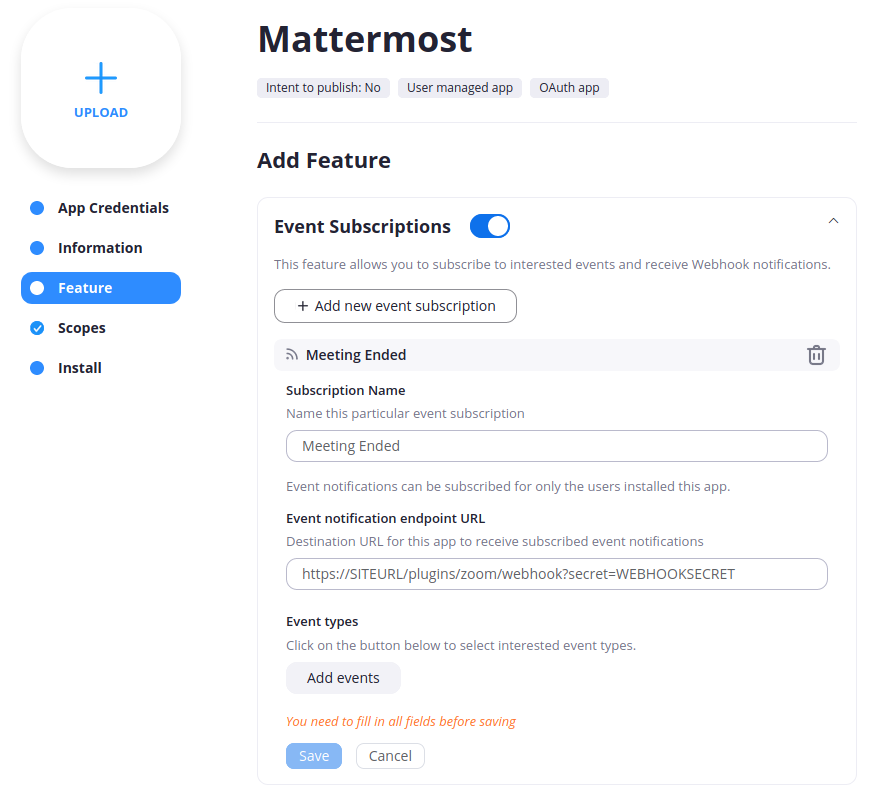

# Webhook Configuration

## Configure Webhook Events

When a meeting finishes in Zoom, the original link shared in the channel can be changed to indicate the meeting has ended and how long it lasted.  To enable this functionality, we need to create a webhook subscription in Zoom that tells the Mattermost server every time a meeting ends, then Mattermost can update the original Zoom message. 

* Click on **Feature**
* Enable **Event Subscriptions**
* Click **Add New Event Subscription** and give it a name \(e.g. "Meeting Ended"\)
* Enter a valid **Event notification endpoint URL** \(`https://SITEURL/plugins/zoom/webhook?secret=WEBHOOKSECRET`\).
  * `SITEURL` should be your Mattermost server URL
  * `WEBHOOKSECRET` is generated during [Mattermost Setup](../mattermost-setup.md).

* Click **Add events** and select the **End Meeting** event

* Click **Done** and then save your App.

