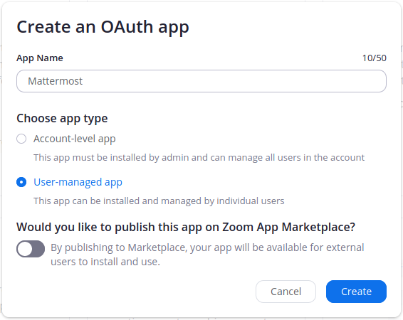
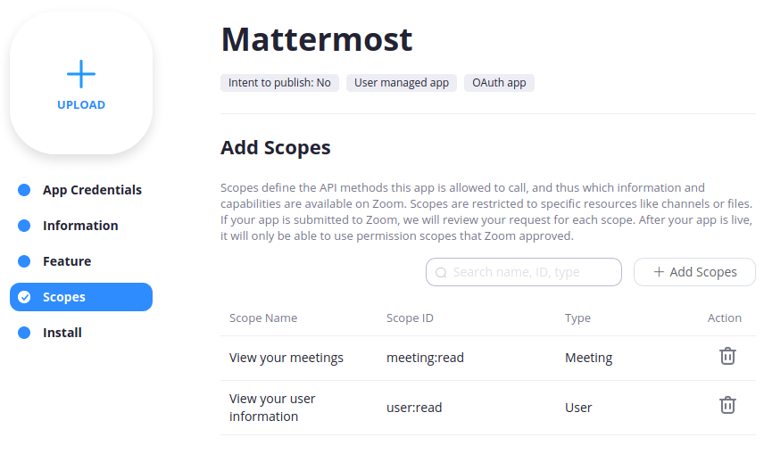

# Zoom Setup \(OAuth\)

You can set the **OAuth ClientID** and **OAuth Secret**, generated by Zoom and use it to create meetings and pull user data.

**Note:** If you've been using Zoom prior to v1.4 you likely have a webhook-type app configured in Zoom. These are not compatible with Zoom v1.4 and you may experience issues with meeting update information not being posted.

To remedy this, remove the app. Then follow the steps provided [here](https://mattermost.gitbook.io/plugin-zoom/installation/zoom-configuration/webhook-configuration) to configure the new webhook. 

## Create an App for Mattermost to Connect With

* Go to [https://marketplace.zoom.us/](https://marketplace.zoom.us/) and log in as an admin.
* In the top left click on **Develop** and then **Build App**.
* Select **OAuth** in **Choose your app type** section.
* Enter a name for your app.
* Choose **User-managed app** as the app type.
* Choose whether you **Would like to publish this app on Zoom Marketplace**. In most cases you will want this to be disabled, but the plugin support also apps to be published in the Zoom Marketplace.
* Click **Create**.

## Configure Your New OAuth App to Work with Mattermost

* If you **would like to publish on Zoom Marketplace**, you will find two sets of values: **development** and **production**. Make sure you follow the next steps with the production values.
* Go to the **App Credentials** tab on the left. Here you'll find your **Client ID** and **Client Secret**.
  * These will be needed during [Mattermost Setup](../mattermost-setup.md).
* Enter a Valid **Redirect URL for OAuth** \(`https://SITEURL/plugins/zoom/oauth2/complete`\) and add the same URL under **Whitelist URL**.
  * `SITEURL` should be your Mattermost server URL

## Add User Scopes to the App

* Click on **Scopes**.
* Add following scopes **meeting:read**, **user:read**.

## Deauthorization

This plugin allows users to be deauthorized directly from Zoom, in order to comply with Zoom’s commitment to security and the protection of user data. If you **would like to publish on Zoom Marketplace**, you will be able to set up a Deauthorization URL.

* Click on **Information**.
* Near the end of the page, you will find a section called **Deauthorization Notification**.
* Enter a valid **Endpoint URL** \(`https://SITEURL/plugins/zoom/deauthorization?secret=WEBHOOKSECRET`\). 
  * `SITEURL` should be your Mattermost server URL.
  * `WEBHOOKSECRET` is generated during [Mattermost Setup](../mattermost-setup.md).

## Finish Setting up Mattermost Server

* Follow the instructions for [Mattermost Setup](../mattermost-setup.md)
