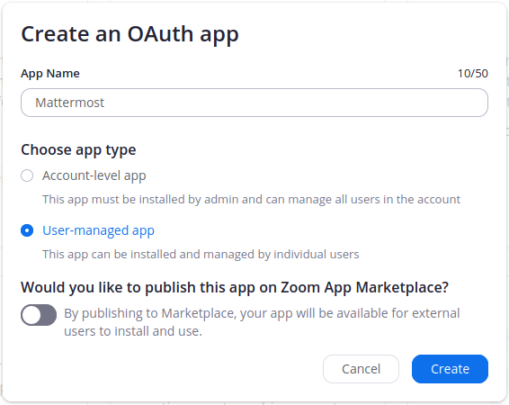
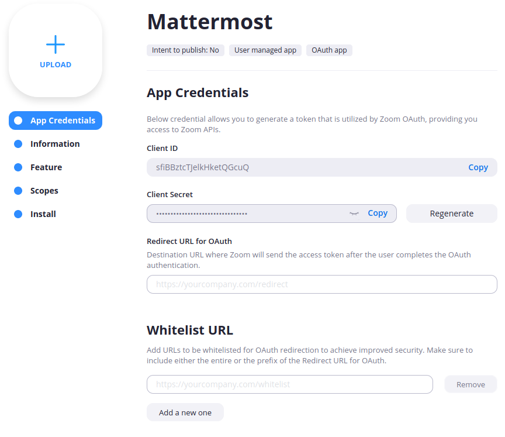
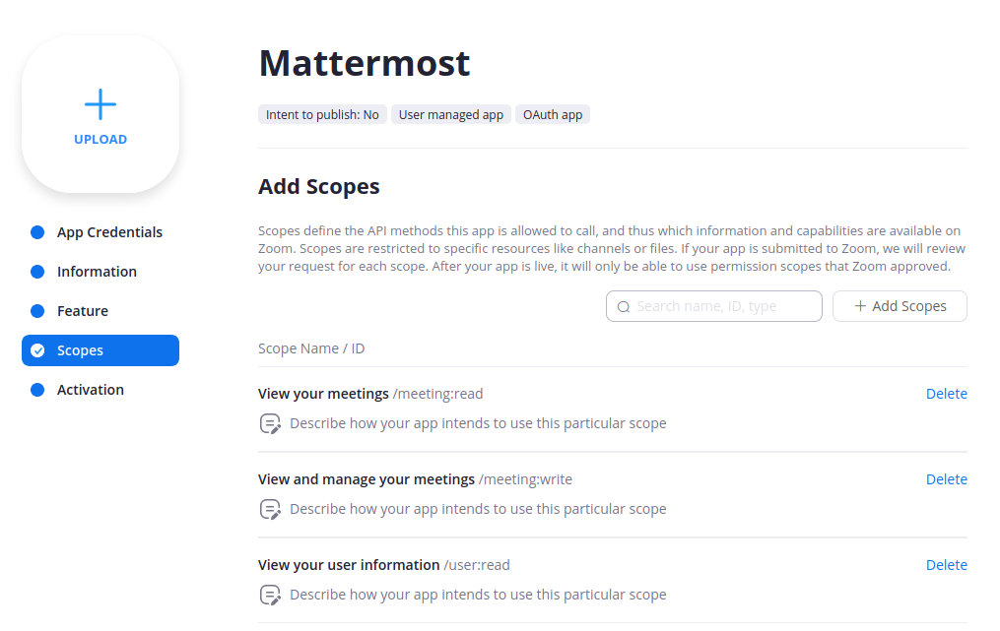
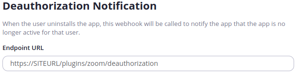

# Zoom Setup \(User Level App\)

You can set the **OAuth ClientID** and **OAuth Secret**, generated by Zoom, and use it to create meetings and pull user data.

**User-level Apps** require **each user** to authorize the Mattermost App to access their Zoom account individually. If you prefer to authorize its access by an admin on behalf of the whole Zoom organization you should create a [Zoom Account-Level App](zoom-setup-oauth.md).

## Create an app for Mattermost

1. Go to [https://marketplace.zoom.us/](https://marketplace.zoom.us/) and log in as an admin.
2. In the top left select **Develop** and then **Build App**.
3. Select **OAuth** in **Choose your app type** section.
4. Enter a name for your app.
5. Choose **User-managed app** as the app type.
6. Choose whether you **Would like to publish this app on Zoom Marketplace**. In most cases you'll want this to be disabled, but the plugin supports apps that are published in the Zoom Marketplace.
7. Select **Create**.

## Configure your new OAuth app to work with Mattermost

If you **would like to publish on Zoom Marketplace**, you'll find two sets of values: **development** and **production**. Make sure you follow the next steps with the production values.

1. Go to the **App Credentials** tab on the left. Here you'll find your **Client ID** and **Client Secret**. These will be needed during [Mattermost Setup](../mattermost-setup.md).
2. Enter a valid **Redirect URL for OAuth** \(`https://SITEURL/plugins/zoom/oauth2/complete`\) and add the same URL under **Whitelist URL**. Note that `SITEURL` should be your Mattermost server URL.

## Add user scopes to the app

Select **Scopes** and add the following scopes: **meeting:write**, **user:read**.

## Do not perform the install step

Zoom has one last option called **Install**. There is no need to perform this action. However, if you perform this action inadvertently, you'll see an error on Mattermost. This is expected.

## Deauthorization

This plugin allows users to be deauthorized directly from Zoom, in order to comply with Zoom’s commitment to security and the protection of user data. If you **would like to publish on Zoom Marketplace**, you can set up a deauthorization URL.

1. Select **Information**.
2. Near the end of the page is a section called **Deauthorization Notification**.
3. Enter a valid **Endpoint URL** \(`https://SITEURL/plugins/zoom/deauthorization?secret=WEBHOOKSECRET`\). 
   * `SITEURL` should be your Mattermost server URL.
   * `WEBHOOKSECRET` is generated during [Mattermost Setup](../mattermost-setup.md).

## Finish setting up Mattermost server

Follow the instructions for [Mattermost Setup](../mattermost-setup.md)

